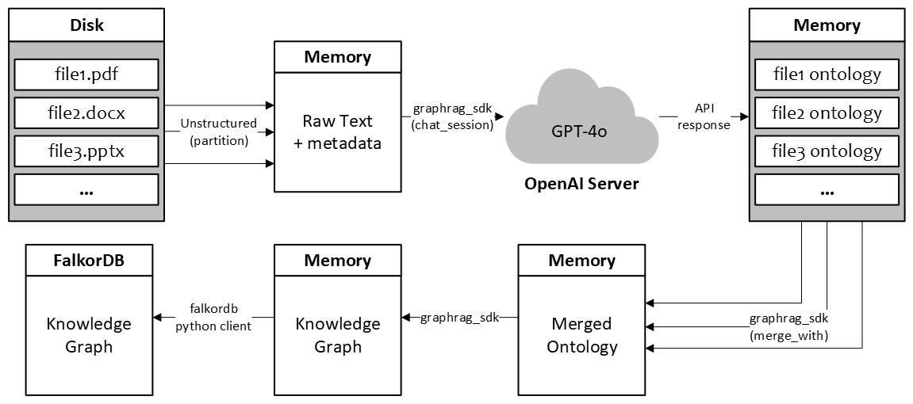

Here’s a more concise version of your README that retains all key points:

---

# Batch2KnowledgeGraph

This project introduces an efficient multiprocess workflow to integrate the `unstructured-io` library with the `GraphRAG-SDK` framework for generating knowledge graphs.

The [unstructured](https://github.com/Unstructured-IO/unstructured) library supports data extraction for Retrieval-Augmented Generation (RAG) across various file types.  
The [GraphRAG-SDK](https://github.com/FalkorDB/GraphRAG-SDK) framework facilitates building RAGs using FalkorDB's knowledge graph database.

---

### Motivation

|  | 
| :---: |
| General Workflow: Unstructured + GraphRAG-SDK |

Key challenges in the workflow include:

1. **Lack of Asynchronous Operations:** Neither `unstructured` nor `GraphRAG-SDK` provides async functions, crucial for I/O-bound tasks.

2. **Inefficiencies in `unstructured_ingest`:**  
   - Forces processed files to be written to disk, increasing I/O overhead.  
   - Lacks memory-based file handling and async support.

3. **Synchronous Ontology Creation in `GraphRAG-SDK`:**  
   The `CreateOntologyStep` class synchronously loads all sources and then uses a thread pool for API calls, leading to inefficiencies. A producer-consumer model would improve performance.

---

### Implemented Solution

1) **Multiprocessing**: Instead of rewriting libraries for async support, the workflow employs a multiprocess approach:  

| Process | Thread Type | Responsibility |
|:--:|:--:|:--:|
| Process A  | New thread | Loads sources. |
| Process B  | New thread | Sends API calls and generates individual ontologies. |
| Process C  | Program thread | Merges individual ontologies into the final ontology. |

2) **Concurrency:** Each process uses thread pools for parallel task execution.
3) **Inter-Process Communication:** Queues manage data flow between processes:

  | Queue       | Purpose                                                    |
  |-------------|------------------------------------------------------------|
  | `documents` | Transfers loaded sources from Process A to Process B.      |
  | `signals`   | Carries status signals from Process A to Process C.        |
  | `ontologies`| Transfers generated ontologies from Process B to Process C.|

---

### Class Responsibilities

| Class | Responsibility |
| :---: | :---: |
| **`UnstructuredSource`** | Extends `AbstractSource` from `GraphRAG-SDK` to act as a data source. |
| **`Loader`** | Loads `UnstructuredSource` and extracts data using the `unstructured` library. |
| **`ConcurrentCreateOntologyStep`** | Extends `CreateOntologyStep` from `GraphRAG-SDK` to implement the multiprocess workflow. |
| **`OntologyHub`** | Maintains the final ontology and allows extensions via the multiprocess workflow. |

---